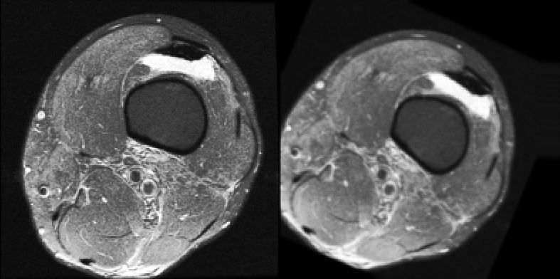
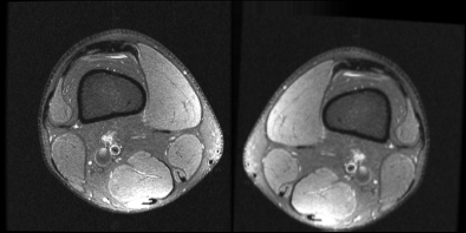

# Oversample Image Data with Augmentation

* This repository can be used for handle unbalanced image datasets with binary labels by applying some image augmentations.
* It chooses the minority labeled samples and perform augmentations to oversample them by using torchsample.transform functions.
* The repository is designed to work with .npy datasets, but it can be forked with a little effort to work with other type of datasets.
## Install and Run

Prepare project;

```
  git clone https://github.com/gkoays/Oversample-Image-Data-with-Augmentations.git
  cd oversample-with-augmentation
  pip install requirements.txt
```
* The repository have an example setup which contains an example label file. The example image dataset can be downloaded from [here](https://drive.google.com/drive/folders/1WS4clKiOp98mNKZgJyLAViVRSQ0B3bsq?usp=sharing) and extracted to `image_file_example` folder in the repository. The dataset is a part of the public [MRNet Dataset](https://stanfordmlgroup.github.io/competitions/mrnet/) which includes multiple channeled data in every .npy file. 
* There should be a label information file which contains sample ids and labels like below. The repository contains an example label file in `./data/` folder.
* The label file should be specified in "label_file" parameter in `config.py` file.

| id | label     | 
| :-------- | :------- |
| `1130` | `1` |
| `1131` | `0` |
| `1132` | `1` |
| `...` | `...` |

* The dataset path that wanted to be worked on should be specified in "images_path" parameter in `config.py` file.
* The path which is desired to contains the augmented and newly generated data should be specified in "new_created_images_path" parameter in `config.py` file.


* To generate new augmented images and a new balanced label information file simply do:
```
  python main.py
```

* The repository also contains an example data loader class in `dataloader.py`. It can be used for directly generating a dataloader class with the newly generated set to use in Pytorch projects.

* Example original and augmented images:
  

  
